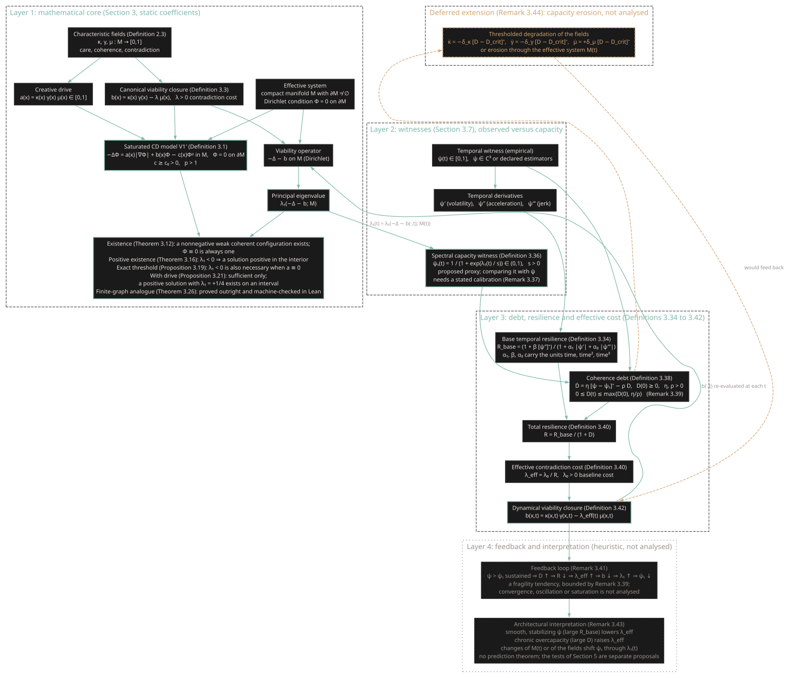

# The CD Stack

How the pieces of the framework fit together, from the characteristic fields to the temporal closure. The diagram is generated from one source in the repository, `paper/cd_stack.dot`, and the same source produces Figures 1 and 2 of the paper, so the picture here and the picture in the paper cannot drift apart. Statement numbers refer to the paper.

*Click the diagram to open it at full size.*

## Reading the diagram

**Layer 1: the mathematical core (Section 3).** The characteristic fields care \(\kappa\), coherence \(\gamma\) and contradiction \(\mu\) (Definition 2.3) define the creative drive \(a = \kappa\gamma\mu\) and, through the canonical closure (Definition 3.3), the viability potential \(b = \kappa\gamma - \lambda\mu\). The saturated model V1′ (Definition 3.1) is the Dirichlet problem \(-\Delta\Phi = a|\nabla\Phi| + b\Phi - c\Phi^p\) on a compact manifold with boundary. The operator \(-\Delta - b\) has a principal eigenvalue \(\lambda_1\). What is proved: a nonnegative solution always exists and the zero field is one (Theorem 3.12); \(\lambda_1 < 0\) gives a solution positive in the interior (Theorem 3.16); the condition is also necessary when \(a \equiv 0\) (Proposition 3.19) and only sufficient otherwise (Proposition 3.21); the finite-graph analogue (Theorem 3.26) is machine-checked in Lean. This is Figure 1 of the paper.

**Layer 2: witnesses (Section 3.7).** An empirical temporal witness \(\psi(t) \in [0,1]\) and its derivatives (volatility, acceleration, jerk) describe what a system is doing. The spectral capacity witness \(\psi_s(t) = 1/(1 + \exp(\lambda_1(t)/s))\) (Definition 3.36) turns the eigenvalue of the current operator into a number on the same scale. It is a proposed proxy; comparing it with \(\psi\) needs a stated calibration (Remark 3.37).

**Layer 3: debt, resilience and effective cost (Definitions 3.34 to 3.42).** Sustained operation above capacity, \(\psi > \psi_s\), accumulates coherence debt \(D\) (Definition 3.38), which is bounded a priori by \(\max\{D(0), \eta/\rho\}\) (Remark 3.39). Debt lowers the total resilience \(R = R_{\mathrm{base}}/(1 + D)\) and raises the effective contradiction cost \(\lambda_{\mathrm{eff}} = \lambda_0/R\) (Definition 3.40), which enters the dynamical closure \(b(x,t) = \kappa\gamma - \lambda_{\mathrm{eff}}(t)\mu\) (Definition 3.42). The closure feeds back into Layer 1: the operator and \(\lambda_1(t)\) are re-evaluated at each time. This is Figure 2 of the paper.

**Layer 4: feedback and interpretation (heuristic).** The loop \(\psi > \psi_s \Rightarrow D\uparrow \Rightarrow R\downarrow \Rightarrow \lambda_{\mathrm{eff}}\uparrow \Rightarrow b\downarrow \Rightarrow \lambda_1\uparrow \Rightarrow \psi_s\downarrow\) is a fragility tendency (Remark 3.41), bounded by the debt bound but not analysed as a dynamical system. The architectural reading (Remark 3.43) is interpretive. The falsifiability tests of Section 5 are separate proposals, not consequences of this loop.

**Deferred extension (Remark 3.44).** Letting prolonged debt erode the fields themselves is stated as a possible extension and is not analysed.

## Status at a glance

| Layer | Status | Where |
|---|---|---|
| Mathematical core | Proved (Theorems 3.12, 3.16, 3.26; Propositions 3.19, 3.21) | Section 3, Figure 1 |
| Witnesses | Defined; \(\psi_s\) is a proposed proxy | Section 3.7, Figure 2 |
| Debt, resilience, closure | Defined, with an a priori bound; no well-posedness theorem for the coupled system | Section 3.7, Figure 2 |
| Feedback and interpretation | Heuristic | Remarks 3.41 and 3.43 |
| Capacity erosion | Deferred | Remark 3.44 |

Regenerate the diagram with `make -C paper` after editing the source; the paper workflow checks that every statement number it cites exists in the rebuilt PDF.
